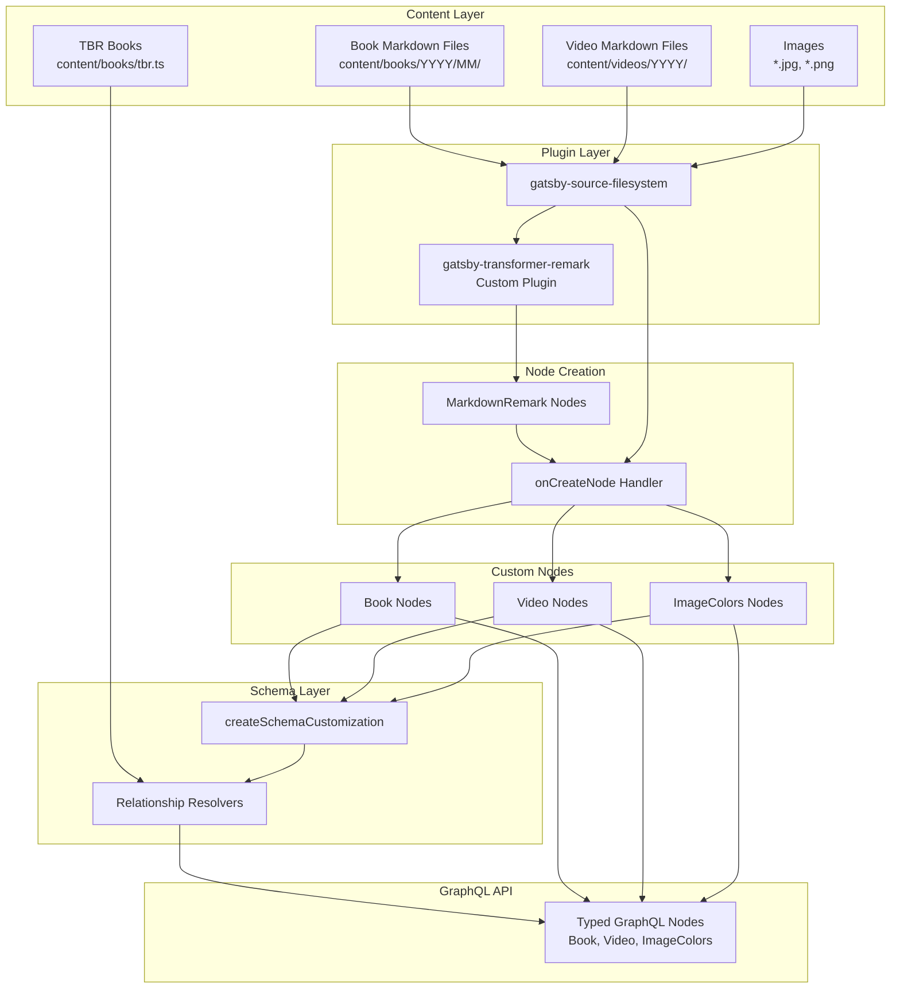

# chareads.com

[](https://github.com/pouretrebelle/chareads.com/actions/workflows/ci.yml) [](https://percy.io/33e2c69b/chareads.com) [](https://github.com/carloscuesta/gitmoji)

## :raised_hands: Development

- `npm install` installs all the site's dependencies
- `npm start` runs [Gatsby](https://www.gatsbyjs.org/) in dev mode on [localhost:2000](http://localhost:2000)

## :construction_worker: Being good

- We use [Typescript](https://www.typescriptlang.org/) for type checking, and it's hella strict
- We use [Prettier](https://prettier.io/) for consistent code styling, set it up for your editor with [these instructions](https://prettier.io/docs/en/editors.html) to run on file save
- `npm run lint` uses [ESLint](https://eslint.org/) with a bunch 'o plugins to check you're not writing shit syntax
- `npm run test` runs [Jest](https://jestjs.io/) for all the unit tests

## :rocket: Deployment

The site is deployed to [pouretrebelle.github.io/chareads.com](https://pouretrebelle.github.io/chareads.com/) on the `gh-pages` branch. This is run automatically by GitHub Actions for every commit to main, and at midnight every night.

Part of the build script runs [a script to scrape the current video stats from the YouTube API](https://github.com/pouretrebelle/chareads.com/blob/main/scripts/stats/getYouTubeStats.ts), this is reliant on a `YOUTUBE_API_TOKEN` env var.

## :hammer: Scripts

- `npm run sync:videos` scaffolds video content for recent YouTube videos via the API.
- `npm run sync:books` scaffolds book content for recently-read books using Goodreads export data ([download from here](https://www.goodreads.com/review/import)).
- `npm run sync:tbr` imports data for unread Goodreads books, to add affiliate links to timestamp references

The video and book sync scripts take a count argument, for example use `npm run sync:videos -- 2` to scaffold the two most recent videos.

---

## :books: Custom Content & GraphQL Architecture

This project uses a custom content management system that transforms filesystem-based markdown content into strongly-typed GraphQL nodes with intelligent cross-referencing capabilities.

### System Overview



### Content Structure

**Books**: `content/books/YYYY/MM/DD-slug/index.md`
- Organized by year, month, and prefixed with a sortable day number
- Each book has its own directory with `index.md` and `cover.jpg`
- Frontmatter includes metadata: title, author, ISBN, ratings, read dates, tags, etc.

**Videos**: `content/videos/YYYY/MM/DD-slug/index.md`
- Organized by year and month with day-prefixed directories
- Contains YouTube metadata and timestamps
- Uses `ownedBy` field to link to a primary book (string format: "Title, Author")
- Timestamps can reference books via `book` field

**TBR (To Be Read)**: `content/books/tbr.ts`
- TypeScript file exporting array of unread books with ISBNs
- Used for generating affiliate links in video timestamps

### Node Transformation Pipeline

#### Phase 1: MarkdownRemark Creation

The **custom `gatsby-transformer-remark` plugin** (in `/plugins`) transforms markdown files into `MarkdownRemark` nodes:

1. Parses frontmatter using gray-matter
2. Creates base `MarkdownRemark` nodes with:
   - `frontmatter`: Parsed YAML metadata
   - `rawMarkdownBody`: Raw markdown content
   - `fileAbsolutePath`: Full path to source file

#### Phase 2: Custom Node Creation

The `onCreateNode` handler in [`src/lib/gatsby-node/onCreateNode.ts`](src/lib/gatsby-node/onCreateNode.ts) transforms `MarkdownRemark` nodes into domain-specific nodes:

**For Books**:
- Enriches frontmatter with computed fields:
  - `slug`: Generated from frontmatter (YYYY/MM/title-author)
  - `isbn10`/`isbn13`: Normalized from either format
  - `dateLastRead`: Latest date from `readDates` array
  - `sortingDate`: Special sorting logic accounting for series books
  - `links`: Generated affiliate links (Goodreads, Amazon, Bookshop.org)
- Creates `Book` node type

**For Videos**:
- Merges YouTube statistics from `youTubeStats.ts` (scraped via API)
- Generates slug from frontmatter
- Preserves timestamps array and book references
- Creates `Video` node type

**For Images**:
- Extracts color palette using Vibrant.js
- Creates `ImageColors` child node with 6 color swatches
- Copies to `/public/static/` for direct access
- Adds `staticPath` field to image node

### Schema Customization & Relationships

The [`createSchemaCustomization`](src/lib/gatsby-node/createSchemaCustomization.ts) phase defines custom GraphQL types and establishes relationships between nodes.

#### Book Node Extensions

```typescript
type Book implements Node {
  video: Video              // Reverse lookup: find video that owns this book
  relatedBooks: [Book]      // Algorithm-generated related books
}
```

#### Video Node Extensions

```typescript
type Video implements Node {
  book: Book                // Primary book from ownedBy field
  relatedBooks: [Book]      // Books involved in video + related
}

type VideoTimestamps {
  text: String!             // Display text (from text or book field)
  book: Book                // Resolved book reference
}
```

#### Relationship Resolvers

**String-to-Book Resolution** ([`relateBookByField`](src/lib/gatsby-node/utils/schema.ts)):
- Parses book strings like "The Overstory, Richard Powers"
- Performs case-insensitive matching against all Book nodes
- Searches both regular books and TBR books
- Used for: `Video.book`, `VideoTimestamps.book`

**Video-to-Book Reverse Lookup** ([`relateVideoToBook`](src/lib/gatsby-node/utils/schema.ts)):
- Finds video where `book` field matches the current book's title + author
- Enables `Book.video` field

**Related Books Algorithm**:

*For Books* ([`addRelatedBooksToBook`](src/lib/gatsby-node/utils/relatedBooks/forBooks.ts)):
- Returns 8 books most related to the source book
- Uses scoring algorithm based on:
  - Shared tags (weighted by specificity)
  - Same author
  - Series membership
  - Rating similarity
  - Publication date proximity

*For Videos* ([`addRelatedBooksToVideo`](src/lib/gatsby-node/utils/relatedBooks/forVideos.ts)):
- Collects books from `ownedBy` and all `timestamps`
- If fewer than 8 involved books, supplements with related books
- Uses same scoring algorithm against primary/involved books

### Page Generation

The [`createPagesStatefully`](src/lib/gatsby-node/createPagesStatefully.ts) handler:
1. Queries all `Book` and `Video` nodes
2. Creates dynamic pages for each at their `slug` path
3. Passes node `id` as page context for component queries
4. Creates static pages for routes defined in `src/routes`

### Key Design Patterns

**Filesystem-Based IDs**: Content organization (year/month/day prefix) creates natural sorting and unique identifiers without needing database-style IDs.

**String-Based Cross-References**: Videos reference books using "Title, Author" strings rather than IDs, allowing references to:
- Books that exist as content
- Books in the TBR list
- Books not yet in the system

**Lazy Relationship Resolution**: Book/video relationships are resolved at GraphQL query time via custom resolvers, not during node creation. This allows for complex queries without circular dependencies.

**Dual Node Types**: Keeping `MarkdownRemark` nodes alongside custom `Book`/`Video` nodes allows the Remark plugin ecosystem to process markdown while providing clean typed interfaces for queries.

**Computed Fields as First-Class Data**: ISBNs, dates, slugs, and affiliate links are computed during node creation and become queryable fields, avoiding runtime calculation.

### Querying Content

The GraphQL API provides fully-typed nodes:

```graphql
query BookPage($id: String!) {
  book(id: { eq: $id }) {
    title
    author
    slug
    rating5
    html
    image {
      childImageColors {
        vibrant
      }
    }
    video {
      youtubeId
      viewCount
    }
    relatedBooks {
      title
      slug
      image {
        childImageColors {
          vibrant
        }
      }
    }
  }
}
```

All relationships are traversable, types are enforced, and the related books algorithm ensures relevant recommendations across the content graph.
